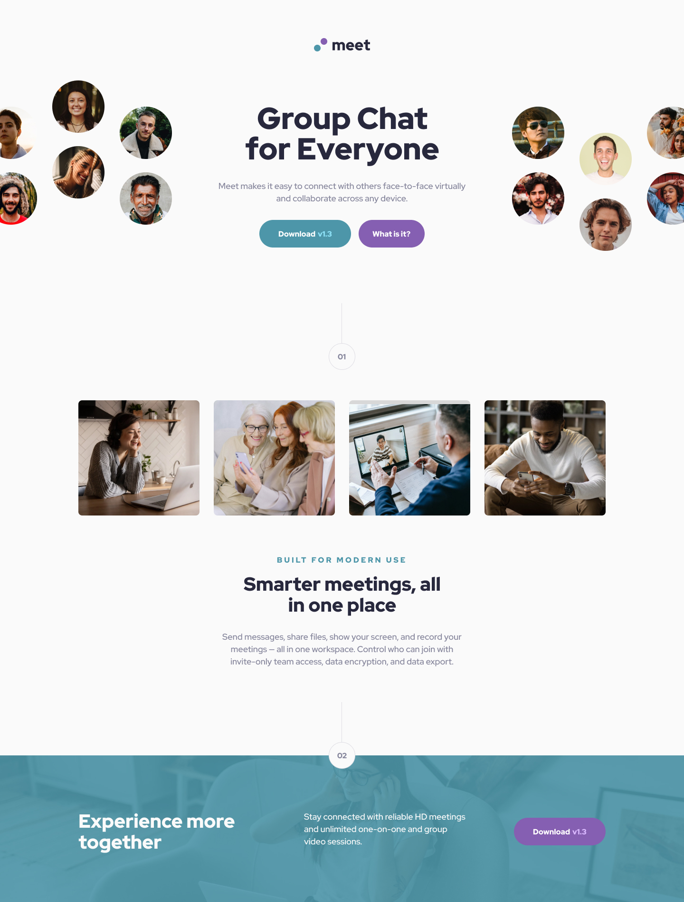

<!-- Headline -->
 

  

  <h3 align="center">I'm Fabra - Front-end developer</h3>
  <h5 align="center">By Daniel Fabra</h3>

  

    Web layout solution based on the design of <b>Frontend Mentor</b>
     
    <a target="_blank" href="https://www.frontendmentor.io/challenges/meet-landing-page-rbTDS6OUR"><strong>View design»</strong></a>
     
     
    <a target="_blank" href="https://meet-landing-page-imfabra.vercel.app/">View Solution Demo</a>
    .
    <a target="_blank" href="https://www.linkedin.com/in/danielj-fabra/">Contact Me</a>
    .
    <a target="_blank" href="https://www.instagram.com/imfabra/">Follow Me</a>
  

 
 
<h1 align="center"> "Meet landing page" - I'm Fabra   [Frontend Mentor]</h1>
 

    

 

<!-- Table of contents -->
## Table of contents

- [About The Project](#about-the-project)
  * [The challenge](#the-challenge)
- [Getting Started](#getting-started)
  * [Screenshot of the solution](#screenshot-of-the-solution)
    + [Desktop](#desktop)
    + [Mobile](#mobile)
  * [Built with](#built-with)
  * [Links](#links)
- [Author](#author)

 

<!-- Main -->
## About The Project
This is a solution to the [Meet landing page challenge on Frontend Mentor](https://www.frontendmentor.io/challenges/meet-landing-page-rbTDS6OUR). Frontend Mentor challenges help you improve your coding skills by building realistic projects. 

### The challenge

> Users should be able to:
>
> - View the optimal layout depending on their device's screen size
> - See hover states for interactive elements

 

## Getting Started

### Screenshot of the solution
#### Desktop

#### Mobile

### Built with

- Semantic HTML5 markup
- CSS custom properties
- Flexbox
- Mobile-first workflow
- [BEM](https://en.bem.info/methodology/) - BEM methodology

### Links

- Solution URL: [Solution URL](https://www.frontendmentor.io/solutions/meet-landing-page-html5-css3-flexbox-im-fabra-KJdWeCGTJ)
- Live Site URL: [Live site URL](https://meet-landing-page-imfabra.vercel.app/)

 

## Author
- **Daniel Fabra** - *Front-end Developer* - [I'm Fabra](https://github.com/imfabra)
  - Frontend Mentor - [DanielFabra](https://www.frontendmentor.io/profile/DanielFabra)
  - Instagram - [imfabra](https://www.instagram.com/imfabra/)
  - LinkedIn - [danielj-fabra](https://www.linkedin.com/in/danielj-fabra/)
  - Twitter - [danielj_fabra](https://twitter.com/danielj_fabra)